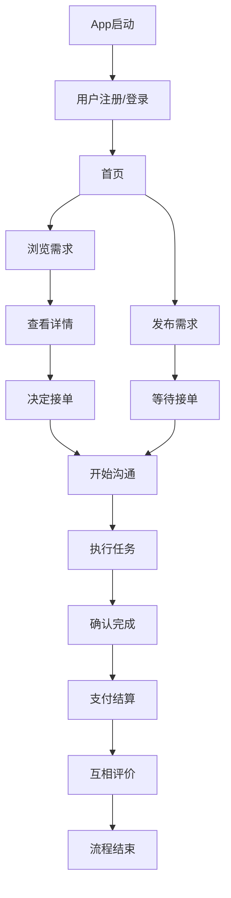
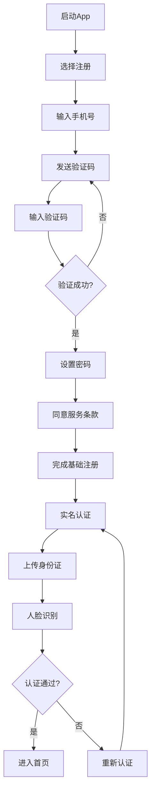
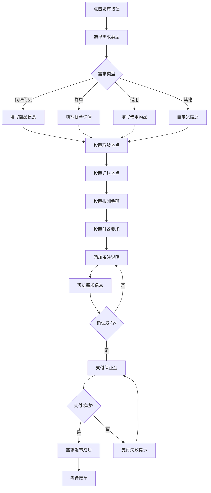
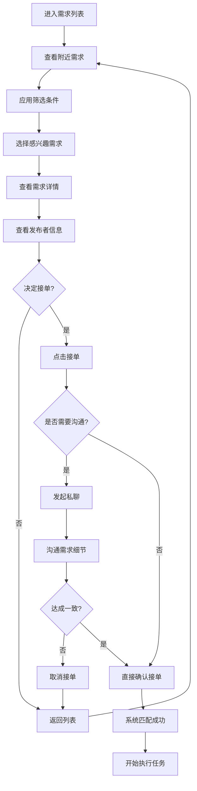
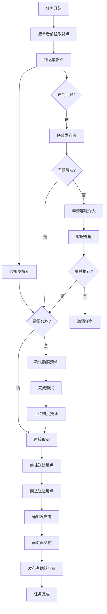
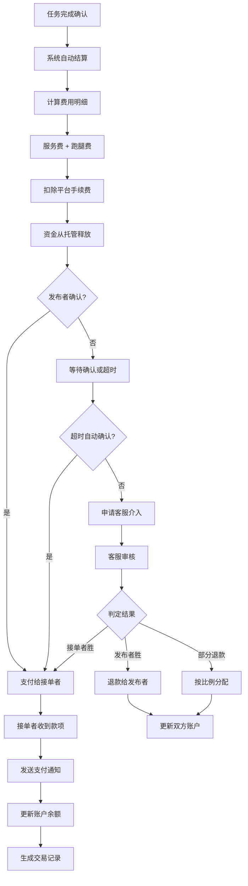
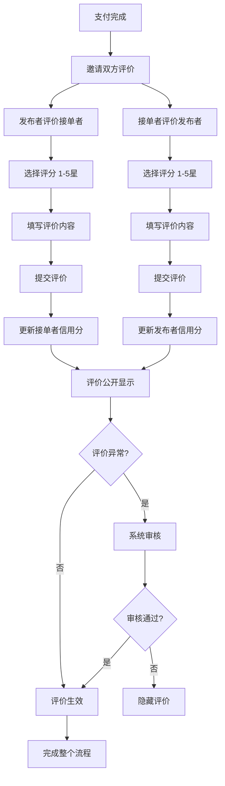
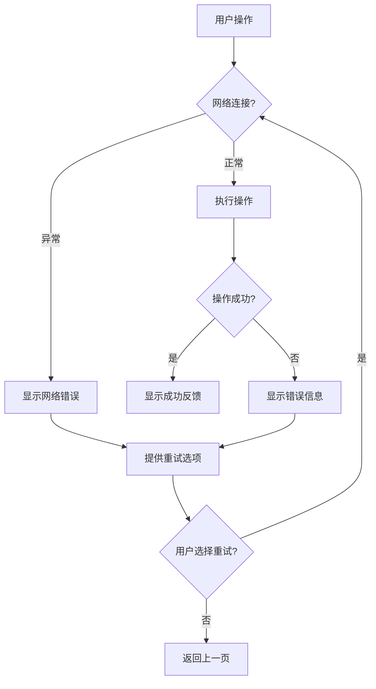
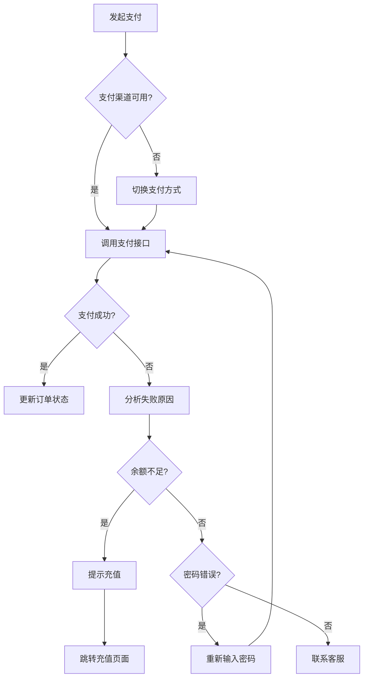
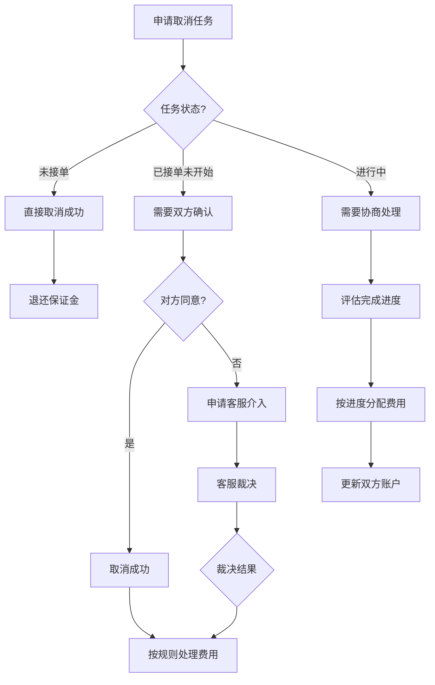

# 硬帮帮 App 用户操作流程图

## 整体用户流程概览

## 详细流程说明

### 1. 用户注册与认证流程

**关键节点说明:**
- **手机验证**: 确保用户手机号真实有效
- **实名认证**: 建立用户信任基础，提高平台安全性
- **服务条款**: 明确用户权责，保护平台利益

### 2. 需求发布流程

**关键节点说明:**
- **需求分类**: 帮助用户快速定位服务类型
- **地点设置**: 确保服务范围的准确性
- **报酬设置**: 平衡用户成本和服务质量
- **保证金机制**: 防止恶意发布，保障接单者权益

### 3. 需求浏览与接单流程

**关键节点说明:**
- **筛选功能**: 帮助用户快速找到合适需求
- **详情查看**: 提供充分信息支持决策
- **沟通机制**: 确保双方需求理解一致
- **匹配确认**: 建立正式的服务关系

### 4. 任务执行与沟通流程

**关键节点说明:**
- **实时通知**: 保持双方信息同步
- **凭证上传**: 建立信任，防止纠纷
- **异常处理**: 提供问题解决机制
- **客服介入**: 最后的争议解决方案

### 5. 支付结算流程

**关键节点说明:**
- **资金托管**: 保障双方资金安全
- **自动结算**: 提高效率，减少纠纷
- **超时机制**: 防止恶意拖延
- **争议处理**: 公平解决纠纷

### 6. 评价反馈流程

**关键节点说明:**
- **双向评价**: 建立互相监督机制
- **信用积累**: 长期信誉体系建设
- **内容审核**: 防止恶意评价
- **公开透明**: 为其他用户提供参考

## 异常流程处理

### 1. 网络异常处理

### 2. 支付异常处理

### 3. 任务取消流程

## 用户决策节点分析

### 关键决策点

1. **注册时机**: 用户何时决定注册
   - 触发因素: 看到感兴趣的需求、想要发布需求
   - 影响因素: 注册流程复杂度、信任度

2. **接单决策**: 用户如何选择接单
   - 考虑因素: 距离、报酬、难度、发布者信誉
   - 决策时间: 平均2-3分钟

3. **发布需求**: 用户何时发布需求
   - 触发场景: 急需帮助、尝试新服务
   - 价格敏感度: 5-20元为主要接受范围

4. **支付方式**: 用户偏好的支付方式
   - 优先级: 微信支付 > 支付宝 > 银行卡
   - 安全考虑: 小额支付接受度高

### 用户流失风险点

1. **注册流程**: 过于复杂的实名认证
2. **首次使用**: 找不到合适的需求或帮手
3. **沟通环节**: 双方期望不一致
4. **支付环节**: 支付失败或安全担忧
5. **服务质量**: 首次体验不佳

### 优化建议

1. **简化注册**: 允许基础功能先体验，后续再完善认证
2. **智能推荐**: 基于位置和历史偏好推荐需求
3. **沟通引导**: 提供沟通模板和常见问题解答
4. **支付保障**: 强化资金安全提示和保障机制
5. **服务标准**: 建立服务质量标准和培训体系

---

*本流程图基于硬帮帮App的产品需求和用户故事地图设计，旨在为产品优化和用户体验改进提供参考依据。*