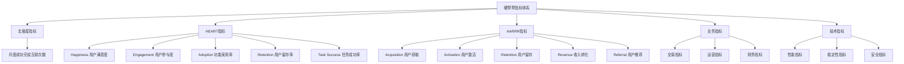
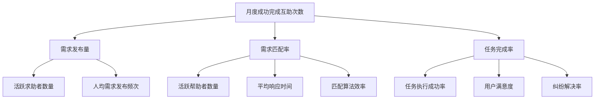
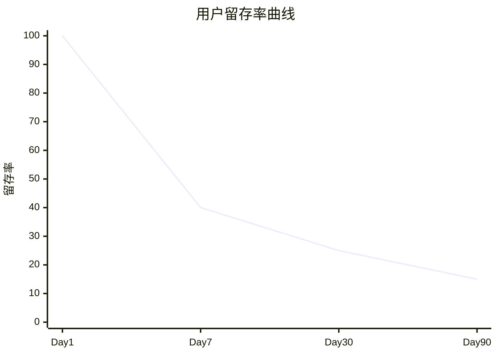
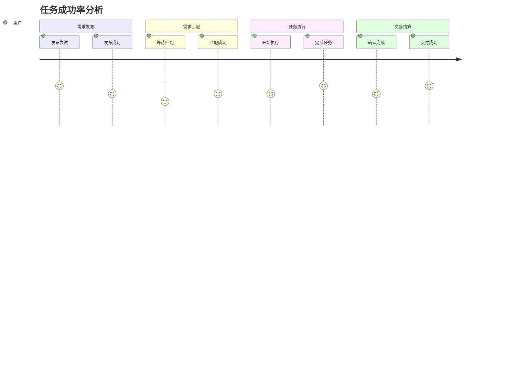
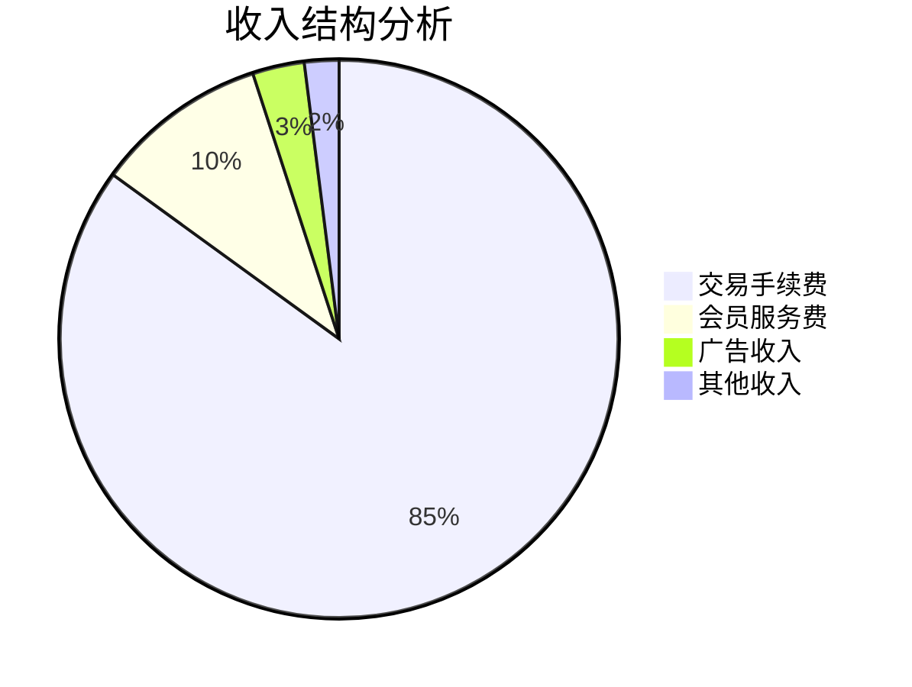

# 硬帮帮(Yinbangbang) 产品评估指标框架 (Metrics Framework)

## 1. 指标框架概述

### 1.1 框架目的
本指标框架旨在建立硬帮帮App的全面数据监测体系，通过科学的指标设计和数据分析，指导产品决策、优化用户体验、验证商业模式，确保产品朝着正确方向发展。

### 1.2 指标体系架构


### 1.3 指标分类原则
- **战略指标**: 反映产品整体健康度和发展方向
- **战术指标**: 指导具体功能优化和运营决策
- **操作指标**: 监控日常运营状况和异常情况
- **诊断指标**: 深入分析问题原因和改进方向

### 1.4 数据驱动文化
- **假设驱动**: 基于假设设计实验和指标
- **数据验证**: 用数据验证产品决策效果
- **持续优化**: 基于数据反馈持续改进产品
- **全员参与**: 让团队所有成员理解和使用数据

## 2. 北极星指标定义

### 2.1 北极星指标选择
**核心指标**: 月度成功完成的互助次数 (Monthly Successful Mutual Aid Count)

### 2.2 选择依据
1. **价值对齐**: 直接反映产品核心价值 - 成功的邻里互助
2. **用户导向**: 体现用户获得的实际价值和满意度
3. **商业相关**: 与平台收入和商业模式直接相关
4. **可操作性**: 可以通过产品和运营手段直接影响
5. **可拆解性**: 可以分解为多个子指标进行深入分析

### 2.3 北极星指标拆解


### 2.4 目标设定
| 阶段 | 时间 | 目标值 | 增长率 |
|------|------|--------|--------|
| MVP v0.1 | 第3个月 | 500次 | - |
| MVP v0.2 | 第6个月 | 2,000次 | 300% |
| v1.0 | 第12个月 | 10,000次 | 400% |
| v1.5 | 第18个月 | 25,000次 | 150% |
| v2.0 | 第24个月 | 50,000次 | 100% |

## 3. HEART指标体系详述

### 3.1 Happiness (用户满意度)

#### 3.1.1 核心指标
- **用户满意度评分**: 4.2/5.0 (目标)
- **净推荐值 (NPS)**: >50 (目标)
- **应用商店评分**: >4.5 (目标)
- **用户投诉率**: <2% (目标)

#### 3.1.2 测量方法
- **应用内评价**: 交易完成后的满意度评分
- **定期调研**: 月度用户满意度问卷调查
- **应用商店**: 监控iOS App Store和Google Play评分
- **客服反馈**: 统计用户投诉和建议

#### 3.1.3 细分维度
- **按用户角色**: 求助者 vs 帮助者满意度
- **按需求类型**: 不同类别需求的满意度差异
- **按地理位置**: 不同城市/区域的满意度对比
- **按用户等级**: 新用户 vs 老用户满意度变化

### 3.2 Engagement (用户参与度)

#### 3.2.1 核心指标
- **日活跃用户 (DAU)**: 2万 (v1.0目标)
- **月活跃用户 (MAU)**: 10万 (v1.0目标)
- **会话时长**: 平均8分钟 (目标)
- **会话频次**: 日均3次 (目标)

#### 3.2.2 深度参与指标
- **需求发布率**: DAU中发布需求的用户比例 >15%
- **接单参与率**: DAU中接单的用户比例 >25%
- **双向参与率**: 既发布又接单的用户比例 >40%
- **连续活跃天数**: 平均连续使用天数 >7天

#### 3.2.3 功能使用指标
- **核心功能使用率**: 发布需求、接单、支付功能使用率
- **社交功能使用率**: 评价、关注、消息功能使用率
- **高级功能使用率**: 筛选、推荐、设置功能使用率

### 3.3 Adoption (功能采用率)

#### 3.3.1 新功能采用
- **功能发现率**: 新功能被用户发现的比例 >80%
- **功能试用率**: 发现后实际试用的比例 >60%
- **功能留存率**: 试用后继续使用的比例 >40%
- **功能深度使用**: 成为重度用户的比例 >20%

#### 3.3.2 关键功能采用路径
```mermaid
funnel
    title 功能采用漏斗
    "功能曝光" : 100
    "功能点击" : 80
    "功能试用" : 60
    "功能完成" : 45
    "重复使用" : 25
```

#### 3.3.3 采用率分析维度
- **按功能类型**: 核心功能 vs 辅助功能采用率
- **按用户群体**: 新用户 vs 老用户采用率差异
- **按推广渠道**: 不同推广方式的功能采用效果

### 3.4 Retention (用户留存率)

#### 3.4.1 留存率指标
- **次日留存率**: >40% (目标)
- **7日留存率**: >25% (目标)
- **30日留存率**: >15% (目标)
- **90日留存率**: >10% (目标)

#### 3.4.2 留存率分析


#### 3.4.3 留存影响因素
- **首次体验质量**: 新用户首次使用成功率
- **价值实现时间**: 用户感受到价值的时间
- **使用频次**: 高频使用用户的留存率更高
- **社交连接**: 有社交关系的用户留存率更高

### 3.5 Task Success (任务成功率)

#### 3.5.1 任务成功指标
- **需求发布成功率**: >98% (目标)
- **需求匹配成功率**: >80% (目标)
- **任务完成成功率**: >85% (目标)
- **支付成功率**: >99% (目标)

#### 3.5.2 任务流程分析


## 4. AARRR指标体系详述

### 4.1 Acquisition (用户获取)

#### 4.1.1 获取渠道指标
- **总注册用户数**: 累计注册用户数量
- **日新增用户数**: 每日新注册用户数量
- **获客成本 (CAC)**: 每个新用户的获取成本
- **渠道转化率**: 不同渠道的注册转化率

#### 4.1.2 渠道效果分析
| 获客渠道 | 转化率 | 获客成本 | 用户质量 | 留存率 |
|----------|--------|----------|----------|--------|
| 应用商店 | 15% | ¥8 | 高 | 45% |
| 社交分享 | 25% | ¥3 | 高 | 55% |
| 线下推广 | 35% | ¥12 | 中 | 40% |
| 广告投放 | 8% | ¥15 | 低 | 25% |
| 口碑推荐 | 45% | ¥2 | 高 | 65% |

#### 4.1.3 获客策略优化
- **渠道投入优化**: 基于ROI调整各渠道投入比例
- **转化路径优化**: 优化从曝光到注册的转化流程
- **用户质量提升**: 关注高质量用户的获取渠道

### 4.2 Activation (用户激活)

#### 4.2.1 激活定义
用户激活定义为：**注册后7天内完成首次成功交易**

#### 4.2.2 激活指标
- **激活率**: 注册用户中达到激活标准的比例 >30%
- **激活时间**: 从注册到激活的平均时间 <3天
- **激活路径**: 用户达到激活的主要路径分析

#### 4.2.3 激活漏斗分析
```mermaid
funnel
    title 用户激活漏斗
    "注册完成" : 100
    "完善资料" : 85
    "实名认证" : 70
    "首次发布/接单" : 50
    "首次交易成功" : 30
```

#### 4.2.4 激活优化策略
- **新手引导优化**: 简化新用户上手流程
- **首次体验优化**: 确保首次使用体验良好
- **激励机制**: 新用户专享优惠和奖励

### 4.3 Retention (用户留存)

#### 4.3.1 留存分层分析
- **新用户留存**: 注册后不同时期的留存率
- **活跃用户留存**: 已激活用户的留存情况
- **付费用户留存**: 有交易行为用户的留存
- **高价值用户留存**: 高频高额用户的留存

#### 4.3.2 留存驱动因素
- **产品价值**: 用户从产品中获得的实际价值
- **使用习惯**: 用户形成的使用习惯和依赖
- **社交关系**: 在平台上建立的社交连接
- **成就感**: 通过帮助他人获得的成就感

### 4.4 Revenue (收入转化)

#### 4.4.1 收入指标
- **月交易总额 (GMV)**: 平台月度交易总金额
- **平台收入**: 扣除手续费后的平台收入
- **用户平均收入贡献 (ARPU)**: 每用户平均收入贡献
- **付费用户比例**: 有交易行为的用户占比

#### 4.4.2 收入结构分析


#### 4.4.3 收入增长驱动
- **交易频次提升**: 提高用户交易频率
- **客单价提升**: 提高平均交易金额
- **用户规模扩大**: 增加付费用户数量
- **服务品类扩展**: 增加收费服务类型

### 4.5 Referral (用户推荐)

#### 4.5.1 推荐指标
- **推荐率**: 用户主动推荐产品的比例 >20%
- **推荐转化率**: 被推荐用户的注册转化率 >40%
- **病毒系数 (K值)**: 每个用户平均带来的新用户数 >0.5
- **推荐用户质量**: 推荐用户的留存率和活跃度

#### 4.5.2 推荐机制设计
- **邀请奖励**: 成功邀请朋友注册的奖励机制
- **双向激励**: 邀请者和被邀请者都获得奖励
- **社交分享**: 便捷的社交媒体分享功能
- **成就展示**: 用户可以分享自己的成就和体验

## 5. 功能级评估指标

### 5.1 需求发布功能

#### 5.1.1 核心指标
- **发布成功率**: >98%
- **发布完成时间**: <60秒
- **发布内容质量**: 通过审核率 >95%
- **发布后匹配率**: >80%

#### 5.1.2 用户行为指标
- **发布频次分布**: 用户发布需求的频次分析
- **分类偏好**: 不同需求分类的发布量分布
- **价格分布**: 用户设置报酬的价格分布
- **地理分布**: 不同地区的需求发布密度

### 5.2 智能匹配功能

#### 5.2.1 匹配效果指标
- **匹配响应时间**: 平均匹配时间 <5分钟
- **匹配成功率**: 发布需求被成功匹配的比例 >80%
- **匹配准确度**: 匹配后完成交易的比例 >85%
- **用户满意度**: 对匹配结果的满意度 >4.0

#### 5.2.2 算法优化指标
- **距离匹配精度**: 实际距离与预估距离的误差
- **偏好学习效果**: 算法学习用户偏好的准确度
- **多维度权重**: 距离、价格、信用分等权重优化

### 5.3 支付交易功能

#### 5.3.1 支付性能指标
- **支付成功率**: >99%
- **支付响应时间**: <3秒
- **退款处理时间**: <24小时
- **资金安全事故**: 0起

#### 5.3.2 交易行为指标
- **支付方式偏好**: 用户选择的支付方式分布
- **交易金额分布**: 不同金额区间的交易量分布
- **交易时间分布**: 一天中不同时段的交易活跃度

### 5.4 信用评分功能

#### 5.4.1 信用系统指标
- **信用分分布**: 用户信用分的分布情况
- **信用分变化**: 用户信用分的变化趋势
- **信用影响**: 信用分对匹配成功率的影响
- **恶意行为识别**: 系统识别恶意行为的准确率

#### 5.4.2 行为约束效果
- **爽约率**: 接单后爽约的比例 <5%
- **纠纷率**: 交易产生纠纷的比例 <3%
- **重复违规率**: 用户重复违规的比例 <1%

## 6. 指标监测计划

### 6.1 数据收集架构

#### 6.1.1 数据源分类
- **应用内埋点**: 用户行为、功能使用、性能数据
- **服务端日志**: 接口调用、错误日志、性能监控
- **第三方数据**: 应用商店数据、支付平台数据
- **用户反馈**: 客服记录、用户调研、评价反馈

#### 6.1.2 数据收集技术栈
- **埋点SDK**: 自研或第三方埋点工具
- **数据传输**: 实时流处理 + 批量处理
- **数据存储**: 数据仓库 + 数据湖
- **数据处理**: ETL工具 + 实时计算

### 6.2 监控面板设计

#### 6.2.1 实时监控面板
- **核心指标**: 实时DAU、交易量、系统状态
- **异常告警**: 关键指标异常自动告警
- **趋势分析**: 关键指标的实时趋势图

#### 6.2.2 运营分析面板
- **用户分析**: 用户增长、留存、活跃度分析
- **业务分析**: 交易分析、收入分析、转化分析
- **产品分析**: 功能使用、用户路径、A/B测试

#### 6.2.3 管理决策面板
- **战略指标**: 北极星指标、关键业务指标
- **财务指标**: 收入、成本、利润分析
- **竞争分析**: 市场份额、竞品对比

### 6.3 报告制度

#### 6.3.1 日报制度
- **发送时间**: 每日上午9:00
- **接收人员**: 产品、运营、技术负责人
- **核心内容**: 
  - 昨日核心指标概览
  - 异常指标预警
  - 关键业务数据

#### 6.3.2 周报制度
- **发送时间**: 每周一上午10:00
- **接收人员**: 全体团队成员
- **核心内容**:
  - 本周指标达成情况
  - 用户增长和留存分析
  - 功能使用情况分析
  - 下周关注重点

#### 6.3.3 月报制度
- **发送时间**: 每月第一个工作日
- **接收人员**: 管理层、投资人
- **核心内容**:
  - 月度目标达成情况
  - 北极星指标分析
  - 用户行为深度分析
  - 产品优化建议
  - 下月工作重点

### 6.4 A/B测试框架

#### 6.4.1 测试流程
1. **假设提出**: 基于数据分析提出优化假设
2. **实验设计**: 设计A/B测试方案和成功指标
3. **流量分配**: 合理分配测试流量
4. **数据收集**: 收集测试期间的关键数据
5. **结果分析**: 统计分析测试结果
6. **决策执行**: 基于结果决定是否全量发布

#### 6.4.2 测试类型
- **功能测试**: 新功能效果验证
- **界面测试**: UI/UX设计效果对比
- **算法测试**: 推荐算法、匹配算法优化
- **运营测试**: 营销活动、推广策略效果

#### 6.4.3 测试管理
- **测试计划**: 制定月度A/B测试计划
- **测试跟踪**: 跟踪测试进度和结果
- **知识沉淀**: 总结测试经验和最佳实践

## 7. 数据分析方法论

### 7.1 用户分群分析

#### 7.1.1 分群维度
- **行为分群**: 基于用户行为模式分群
- **价值分群**: 基于用户价值贡献分群
- **生命周期分群**: 基于用户生命周期阶段分群
- **地理分群**: 基于地理位置分群

#### 7.1.2 典型用户分群
- **新手用户**: 注册不足30天的用户
- **活跃用户**: 月活跃天数>15天的用户
- **核心用户**: 月交易次数>10次的用户
- **流失用户**: 30天未活跃的用户
- **高价值用户**: 月交易额>500元的用户

### 7.2 漏斗分析

#### 7.2.1 核心转化漏斗
```mermaid
funnel
    title 用户转化漏斗
    "应用下载" : 100
    "注册完成" : 60
    "实名认证" : 45
    "首次发布" : 30
    "首次交易" : 20
    "重复使用" : 15
```

#### 7.2.2 漏斗优化策略
- **识别瓶颈**: 找出转化率最低的环节
- **原因分析**: 分析转化率低的具体原因
- **优化实验**: 设计A/B测试验证优化方案
- **效果评估**: 评估优化后的转化率提升

### 7.3 留存分析

#### 7.3.1 留存曲线分析
- **新用户留存**: 分析新用户的留存曲线
- **功能留存**: 分析特定功能的使用留存
- **队列留存**: 按注册时间分队列分析留存

#### 7.3.2 留存影响因素
- **首次体验**: 首次使用体验对留存的影响
- **价值实现**: 用户实现价值的时间点
- **使用频次**: 使用频次与留存的关系
- **社交因素**: 社交关系对留存的促进作用

### 7.4 用户路径分析

#### 7.4.1 路径挖掘
- **常见路径**: 用户最常使用的功能路径
- **高价值路径**: 导向高价值行为的路径
- **流失路径**: 导致用户流失的路径

#### 7.4.2 路径优化
- **路径简化**: 简化复杂的操作路径
- **引导优化**: 优化用户引导和提示
- **异常处理**: 处理路径中的异常情况

## 8. 指标预警机制

### 8.1 预警级别定义

#### 8.1.1 预警级别
- **绿色 (正常)**: 指标在正常范围内
- **黄色 (关注)**: 指标出现异常趋势，需要关注
- **橙色 (警告)**: 指标明显异常，需要采取行动
- **红色 (紧急)**: 指标严重异常，需要立即处理

#### 8.1.2 预警阈值设置
| 指标类型 | 绿色 | 黄色 | 橙色 | 红色 |
|----------|------|------|------|------|
| DAU变化 | ±5% | ±10% | ±20% | ±30% |
| 交易成功率 | >95% | 90-95% | 80-90% | <80% |
| 系统可用性 | >99.5% | 99-99.5% | 98-99% | <98% |
| 用户投诉率 | <1% | 1-2% | 2-5% | >5% |

### 8.2 预警响应机制

#### 8.2.1 响应流程
1. **自动检测**: 系统自动检测指标异常
2. **预警通知**: 根据级别发送不同的通知
3. **问题分析**: 相关人员分析异常原因
4. **应急处理**: 采取相应的应急措施
5. **跟踪恢复**: 跟踪指标恢复情况
6. **复盘总结**: 事后复盘和改进

#### 8.2.2 责任分工
- **技术指标**: 技术团队负责响应和处理
- **产品指标**: 产品团队负责分析和优化
- **运营指标**: 运营团队负责调整和改进
- **业务指标**: 管理层负责决策和资源调配

### 8.3 预警通知机制

#### 8.3.1 通知渠道
- **即时通讯**: 企业微信、钉钉群组通知
- **短信通知**: 紧急情况下的短信告警
- **邮件通知**: 详细的预警报告邮件
- **监控面板**: 实时监控面板显示

#### 8.3.2 通知内容
- **异常指标**: 具体哪个指标出现异常
- **异常程度**: 异常的严重程度和影响范围
- **可能原因**: 初步分析的可能原因
- **建议行动**: 推荐的处理措施

---

**文档状态**: 初稿完成  
**最后更新**: 2024-12-19  
**下次评审**: 2024-12-26  
**关联文档**: PRD.md, Roadmap.md, User_Story_Map.md