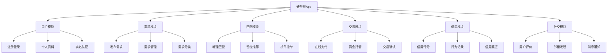
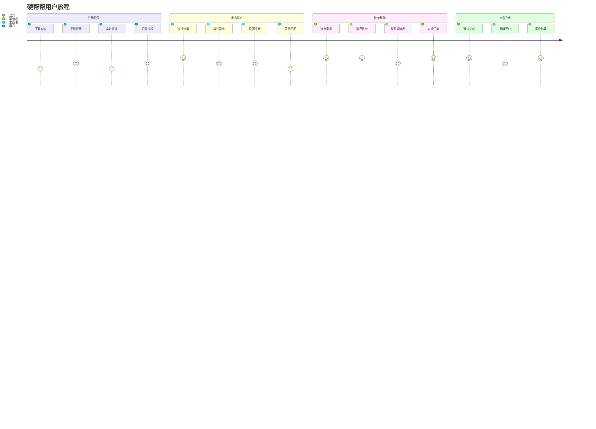
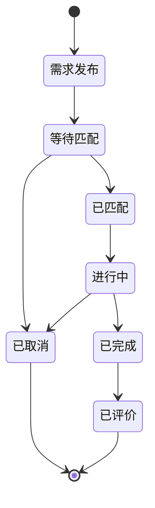

# 硬帮帮(Yinbangbang) 产品需求文档 (PRD)

## 1. 文档信息

### 1.1 版本历史
| 版本 | 日期 | 作者 | 变更内容 |
|------|------|------|----------|
| v1.0 | 2024-12-19 | 产品经理 | 初始版本创建 |

### 1.2 文档目的
本文档旨在详细定义硬帮帮App的产品需求，为设计、开发、测试团队提供明确的产品规格说明和实施指导。

### 1.3 相关文档引用
- 产品路线图 (Roadmap.md)
- 用户故事地图 (User_Story_Map.md)
- 产品评估指标框架 (Metrics_Framework.md)

## 2. 产品概述

### 2.1 产品名称与定位
- **产品名称**: 硬帮帮 (Yinbangbang)
- **产品定位**: 超本地即时互助平台，专注5分钟内可完成的轻量级互助服务
- **目标用户**: 18-35岁务实的年轻人群体

### 2.2 产品愿景与使命
- **愿景**: 成为年轻人身边最贴心的即时互助伙伴，让每个临时小需求都能得到快速响应
- **使命**: 通过超近距离的邻里互助，解决年轻人碎片化时间中的临时小麻烦，提升生活便利性

### 2.3 价值主张与独特卖点(USP)
- **核心价值**: 超近距(5分钟步行范围) + 即时响应 + 轻量互助
- **独特卖点**:
  - 精确到楼栋的定位服务
  - 严格限制5分钟内完成的任务
  - 无接触、低价值、不涉及隐私的安全互助
  - 比社交软件更直接，比商业服务更便宜
  - 顺便认识同小区/同写字楼的邻居

### 2.4 目标平台列表
- **主要平台**: iOS, Android
- **未来考虑**: 微信小程序 (轻量版本)

### 2.5 产品核心假设
1. 年轻人在碎片化时间确实存在大量临时小需求
2. 用户愿意为便利性支付小额费用(1-5元)
3. 超近距离的陌生人互助具有可行性和安全性
4. 信用分机制能够有效约束用户行为
5. 5分钟时限能够平衡效率与可执行性

### 2.6 商业模式概述
- **收入来源**: 平台交易手续费(5-10%)
- **成本结构**: 技术开发、运营推广、客服支持
- **盈利模式**: 规模化后通过手续费实现盈利

## 3. 用户研究

### 3.1 目标用户画像

#### 3.1.1 人口统计特征
- **年龄**: 18-35岁
- **职业**: 白领、学生、自由职业者
- **收入**: 月收入3000-15000元
- **居住**: 城市公寓、学生宿舍、写字楼周边
- **教育**: 大专及以上学历

#### 3.1.2 行为习惯与偏好
- 手机使用频率高，习惯移动支付
- 注重效率和便利性
- 愿意尝试新的互联网服务
- 有一定的陌生人社交接受度
- 时间碎片化，临时需求多

#### 3.1.3 核心需求与痛点
**核心痛点**:
- 临时小需求找朋友太远，找跑腿不值当
- 碎片化时间无法高效利用
- 缺乏就近的即时帮助渠道

**具体需求场景**:
- 下楼取快递时顺带帮拿外卖
- 拼单免配送费(奶茶、咖啡等)
- 临时借用小物件(充电线、雨伞等)
- 代买便利店小商品
- 询问本地信息(WiFi密码、营业时间等)

#### 3.1.4 动机与目标
- **效率动机**: 节省时间和精力
- **经济动机**: 降低小额消费成本
- **社交动机**: 认识邻居，扩展社交圈
- **互助动机**: 帮助他人获得成就感

### 3.2 用户场景分析

#### 3.2.1 核心使用场景详述

**场景1: 代取代买**
- 用户正在下楼取快递，发现邻居有外卖需要代取
- 用户想买便利店商品，但懒得下楼
- 用户需要某个小商品，希望有人代买

**场景2: 拼单省钱**
- 用户想点奶茶但不满足免配送费条件
- 用户想叫外卖但配送费较高
- 用户想团购某个商品获得优惠

**场景3: 临时借用**
- 手机没电需要借充电线
- 下雨需要借雨伞
- 需要某个工具或小物件

#### 3.2.2 边缘使用场景考量
- 紧急情况下的求助(但需控制在安全范围内)
- 信息咨询类需求
- 技能交换类需求(限制在5分钟内)

### 3.3 用户调研洞察
- 年轻人对陌生人互助的接受度逐渐提高
- 小额支付的心理门槛较低(1-5元)
- 地理位置的精确性是安全感的重要来源
- 时间限制能够降低用户的心理负担

## 4. 市场与竞品分析

### 4.1 市场规模与增长预测
- **目标市场**: 中国一二线城市年轻人群体
- **市场规模**: 约2亿潜在用户
- **增长趋势**: 随着城市化进程和共享经济发展，预计年增长率15-20%

### 4.2 行业趋势分析
- 共享经济向更细分领域发展
- 本地化服务需求增长
- 即时性服务成为刚需
- 社区经济兴起

### 4.3 竞争格局分析

#### 4.3.1 直接竞争对手详析

**闪送/UU跑腿**
- 优势: 成熟的配送网络，品牌知名度高
- 劣势: 价格较高，不适合小额需求
- 定价: 起步价8-15元
- 差异化: 我们专注超低价、超近距的轻量互助

**邻里帮**
- 优势: 社区属性强
- 劣势: 用户活跃度低，响应速度慢
- 差异化: 我们强调即时性和5分钟限制

#### 4.3.2 间接竞争对手概述
- 微信群/QQ群: 缺乏标准化流程
- 小区业主群: 覆盖面有限
- 传统跑腿服务: 价格偏高

### 4.4 竞品功能对比矩阵

| 功能特性 | 硬帮帮 | 闪送 | UU跑腿 | 邻里帮 |
|----------|--------|------|--------|--------|
| 超近距定位 | ✅ | ❌ | ❌ | ✅ |
| 即时响应 | ✅ | ✅ | ✅ | ❌ |
| 低价服务 | ✅ | ❌ | ❌ | ✅ |
| 5分钟限制 | ✅ | ❌ | ❌ | ❌ |
| 信用体系 | ✅ | ✅ | ✅ | ❌ |
| 社交属性 | ✅ | ❌ | ❌ | ✅ |

### 4.5 市场差异化策略
- **时间差异化**: 严格5分钟完成限制
- **距离差异化**: 精确到楼栋的超近距服务
- **价格差异化**: 1-5元的微支付模式
- **场景差异化**: 专注临时小需求
- **社交差异化**: 邻里认识的附加价值

## 5. 产品功能需求

### 5.1 功能架构与模块划分

### 5.2 核心功能详述

#### 5.2.1 用户注册与认证模块

**功能描述**: 
作为新用户，我想要快速注册并完成身份认证，以便安全地使用互助服务。

**用户价值**: 
- 确保平台用户真实性和安全性
- 建立用户信任基础
- 降低恶意行为风险

**功能逻辑与规则**:
1. 手机号注册 + 短信验证
2. 实名认证(身份证 + 人脸识别)
3. 位置权限授权(精确到楼栋)
4. 基础信用分初始化(100分)
5. 新用户引导流程

**交互要求**:
- 注册流程不超过3步
- 实名认证可延后但限制功能
- 位置权限必须授权才能使用

**数据需求**:
- 用户基本信息(姓名、手机、身份证)
- 地理位置信息(经纬度、地址)
- 设备信息(设备ID、推送token)

**技术依赖**:
- 短信验证服务
- 实名认证API
- 地图定位服务
- 人脸识别SDK

**验收标准**:
- 注册成功率 > 95%
- 实名认证通过率 > 90%
- 位置定位精度 < 10米
- 注册流程完成时间 < 3分钟

#### 5.2.2 需求发布与管理模块

**功能描述**:
作为求助用户，我想要快速发布临时需求并管理我的需求状态，以便获得及时帮助。

**用户价值**:
- 快速表达需求获得帮助
- 实时跟踪需求处理状态
- 灵活管理需求生命周期

**功能逻辑与规则**:
1. 需求分类选择(代取代买/拼单/借用/其他)
2. 需求描述(限制100字以内)
3. 位置自动定位(可微调)
4. 报酬设置(1-20元范围)
5. 时效设置(默认30分钟)
6. 需求审核机制(关键词过滤)
7. 需求状态管理(发布/匹配/进行中/完成/取消)

**交互要求**:
- 发布流程不超过1分钟
- 支持语音转文字输入
- 实时显示附近帮手数量
- 一键取消和重新发布

**数据需求**:
- 需求内容和分类
- 地理位置和范围
- 报酬金额和支付方式
- 时间戳和有效期

**技术依赖**:
- 地图定位服务
- 内容审核API
- 推送通知服务

**验收标准**:
- 需求发布成功率 > 98%
- 发布流程完成时间 < 60秒
- 需求匹配响应时间 < 5分钟
- 内容审核准确率 > 95%

#### 5.2.3 智能匹配与接单模块

**功能描述**:
作为帮助用户，我想要看到附近的需求并快速接单，以便赚取报酬并帮助他人。

**用户价值**:
- 发现附近赚钱机会
- 快速响应获得订单
- 帮助他人获得成就感

**功能逻辑与规则**:
1. 基于地理位置的需求推送(500米范围内)
2. 智能排序(距离+报酬+信用分+响应时间)
3. 抢单机制(先到先得)
4. 接单确认和联系方式交换
5. 任务进度跟踪
6. 完成确认机制

**交互要求**:
- 需求列表实时刷新
- 一键接单功能
- 导航到目标位置
- 任务进度可视化

**数据需求**:
- 用户位置和活动状态
- 需求列表和详情
- 匹配算法参数
- 任务执行记录

**技术依赖**:
- 实时位置服务
- 推送通知
- 地图导航API
- WebSocket实时通信

**验收标准**:
- 需求推送延迟 < 10秒
- 接单成功率 > 90%
- 位置匹配准确率 > 95%
- 任务完成率 > 80%

#### 5.2.4 支付与资金托管模块

**功能描述**:
作为平台用户，我想要安全便捷地进行支付和收款，以便保障交易安全。

**用户价值**:
- 交易资金安全保障
- 便捷的支付体验
- 透明的费用结构

**功能逻辑与规则**:
1. 预付费模式(发布需求时冻结资金)
2. 资金托管(平台代管直到确认完成)
3. 多种支付方式(微信/支付宝/银行卡)
4. 自动结算(确认完成后自动转账)
5. 平台手续费(5%)
6. 退款机制(未匹配或取消)

**交互要求**:
- 支付流程简洁明了
- 实时显示资金状态
- 支持快捷支付
- 交易记录可查询

**数据需求**:
- 用户支付信息
- 交易流水记录
- 资金托管状态
- 手续费计算

**技术依赖**:
- 第三方支付SDK
- 银行接口
- 加密安全服务

**验收标准**:
- 支付成功率 > 99%
- 资金到账时间 < 24小时
- 支付安全事故 = 0
- 退款处理时间 < 48小时

#### 5.2.5 信用评分与行为约束模块

**功能描述**:
作为平台，我想要建立有效的信用体系，以便约束用户行为并提升服务质量。

**用户价值**:
- 建立可信的交易环境
- 激励良好行为
- 惩罚恶意行为

**功能逻辑与规则**:
1. 初始信用分100分
2. 完成任务+5分，被好评+2分
3. 爽约-10分，被差评-5分
4. 信用分影响接单优先级
5. 低信用分用户限制功能
6. 信用分恢复机制

**交互要求**:
- 信用分实时显示
- 行为记录可查看
- 信用等级可视化

**数据需求**:
- 用户行为记录
- 信用分变化历史
- 评价和投诉数据

**验收标准**:
- 信用分计算准确率 100%
- 恶意行为识别率 > 90%
- 用户投诉处理时间 < 24小时

### 5.3 次要功能描述

- **消息通知系统**: 实时推送任务状态变化
- **用户评价系统**: 双向评价机制
- **客服支持系统**: 在线客服和问题反馈
- **数据统计面板**: 个人数据统计和成就展示
- **邻里发现功能**: 查看附近活跃用户

### 5.4 未来功能储备 (Backlog)

- **语音交互**: 语音发布需求和接单
- **AR导航**: 增强现实导航到目标位置
- **社区活动**: 组织线下邻里活动
- **技能交换**: 扩展到技能类互助
- **商家合作**: 与本地商家合作优惠

## 6. 用户流程与交互设计指导

### 6.1 核心用户旅程地图

### 6.2 关键流程详述与状态转换图

### 6.3 对设计师 (UI/UX Agent) 的界面原型参考说明和要求

**设计原则**:
- **简洁高效**: 界面简洁，操作路径最短
- **即时反馈**: 所有操作都有即时反馈
- **安全感**: 通过设计传达安全可靠的感觉
- **邻里感**: 体现温暖的邻里互助氛围

**关键界面要求**:
1. **首页**: 突出附近需求数量，一键发布按钮醒目
2. **发布页**: 流程简化，智能提示，实时预览
3. **需求列表**: 卡片式设计，距离和报酬突出显示
4. **任务详情**: 信息层次清晰，操作按钮明确
5. **个人中心**: 信用分可视化，成就展示

**色彩建议**:
- 主色调: 温暖橙色(体现帮助和活力)
- 辅助色: 安全绿色(体现可靠和完成)
- 警示色: 注意红色(体现风险和紧急)

### 6.4 交互设计规范与原则建议

- **响应时间**: 所有操作响应时间 < 200ms
- **容错设计**: 重要操作需要二次确认
- **无障碍设计**: 支持语音播报和大字体
- **手势操作**: 支持常用手势(下拉刷新、左滑操作等)

## 7. 非功能需求

### 7.1 性能需求

- **响应时间**: 
  - 页面加载时间 < 2秒
  - 接口响应时间 < 500ms
  - 位置定位时间 < 3秒

- **并发量**: 
  - 支持10万日活用户
  - 峰值并发1000用户
  - 数据库查询响应 < 100ms

- **稳定性**: 
  - 系统可用性 > 99.5%
  - 崩溃率 < 0.1%
  - 内存使用 < 100MB

- **资源使用率**: 
  - CPU使用率 < 70%
  - 内存使用率 < 80%
  - 网络流量优化

### 7.2 安全需求

- **数据加密**: 
  - 传输数据HTTPS加密
  - 敏感数据AES256加密存储
  - 支付数据PCI DSS标准

- **认证授权**: 
  - 多因子身份认证
  - JWT token机制
  - 权限分级管理

- **隐私保护**: 
  - 位置信息脱敏处理
  - 个人信息最小化收集
  - 用户数据删除权

- **防攻击策略**: 
  - API接口限流
  - SQL注入防护
  - XSS攻击防护
  - DDoS攻击防护

### 7.3 可用性与可访问性标准

- **易用性要求**: 
  - 新用户学习成本 < 5分钟
  - 核心功能操作步骤 ≤ 3步
  - 错误恢复机制完善

- **WCAG标准**: 
  - 支持屏幕阅读器
  - 色彩对比度符合AA级标准
  - 字体大小可调节
  - 语音操作支持

### 7.4 合规性要求

- **数据保护**: 符合《个人信息保护法》要求
- **支付合规**: 符合央行支付规范
- **内容审核**: 符合网络内容管理规定
- **实名制**: 符合网络实名制要求

### 7.5 数据统计与分析需求

**关键埋点事件**:
- 用户注册、登录、认证
- 需求发布、接单、完成
- 支付、评价、投诉
- 页面访问、功能使用
- 异常和错误事件

**核心指标**:
- DAU/MAU、留存率
- 需求发布量、完成率
- 交易金额、手续费收入
- 用户满意度、信用分分布

## 8. 技术架构考量

### 8.1 技术栈建议

**移动端**:
- iOS: Swift + UIKit/SwiftUI
- Android: Kotlin + Jetpack Compose
- 跨平台考虑: Flutter或React Native

**后端**:
- 语言: Java/Python/Go
- 框架: Spring Boot/Django/Gin
- 数据库: MySQL + Redis
- 消息队列: RabbitMQ/Kafka

**基础设施**:
- 云服务: 阿里云/腾讯云
- CDN: 静态资源加速
- 监控: Prometheus + Grafana

### 8.2 系统集成需求

- **地图服务**: 高德地图/百度地图API
- **支付服务**: 微信支付/支付宝SDK
- **短信服务**: 阿里云短信/腾讯云短信
- **实名认证**: 阿里云实人认证
- **推送服务**: 极光推送/友盟推送

### 8.3 技术依赖与约束

- **位置精度**: 要求GPS精度 < 10米
- **实时性**: WebSocket长连接支持
- **离线能力**: 关键数据本地缓存
- **版本兼容**: iOS 12+, Android 8+

### 8.4 数据模型建议

**核心实体**:
- User(用户): id, phone, name, credit_score, location
- Request(需求): id, user_id, category, description, reward, location, status
- Order(订单): id, request_id, helper_id, amount, status, created_at
- Payment(支付): id, order_id, amount, method, status
- Review(评价): id, order_id, rating, comment

## 9. 验收标准汇总

### 9.1 功能验收标准矩阵

| 功能模块 | 验收标准 | 测试方法 |
|----------|----------|----------|
| 用户注册 | 注册成功率>95% | 自动化测试 |
| 需求发布 | 发布成功率>98% | 功能测试 |
| 智能匹配 | 匹配响应时间<5分钟 | 性能测试 |
| 支付系统 | 支付成功率>99% | 集成测试 |
| 信用系统 | 计算准确率100% | 单元测试 |

### 9.2 性能验收标准

- 页面加载时间 < 2秒
- 接口响应时间 < 500ms
- 系统可用性 > 99.5%
- 并发用户数 > 1000

### 9.3 质量验收标准

- 代码覆盖率 > 80%
- Bug密度 < 1个/KLOC
- 崩溃率 < 0.1%
- 用户满意度 > 4.0/5.0

## 10. 产品成功指标

### 10.1 关键绩效指标 (KPIs) 定义与目标

**用户增长指标**:
- 月活用户(MAU): 目标10万
- 日活用户(DAU): 目标2万
- 用户留存率: 次日留存>40%, 7日留存>20%

**业务指标**:
- 日均需求发布量: 目标1000单
- 需求完成率: 目标80%
- 平均响应时间: 目标3分钟
- 用户满意度: 目标4.2/5.0

**收入指标**:
- 月交易额: 目标50万元
- 平台手续费收入: 目标2.5万元
- 用户ARPU: 目标25元/月

### 10.2 北极星指标定义与选择依据

**北极星指标**: 月度成功完成的互助次数

**选择依据**:
- 直接反映产品核心价值(互助成功)
- 综合考虑用户活跃度和业务健康度
- 可拆解为多个子指标进行优化
- 与商业目标高度相关

### 10.3 指标监测计划

**数据收集**:
- 实时数据: 用户行为、交易数据
- 定期调研: 用户满意度、NPS
- 第三方数据: 市场份额、竞品分析

**报告频率**:
- 日报: 核心业务指标
- 周报: 用户增长和留存
- 月报: 综合运营分析
- 季报: 产品战略调整

---

**文档状态**: 初稿完成  
**最后更新**: 2024-12-19  
**下次评审**: 2024-12-26