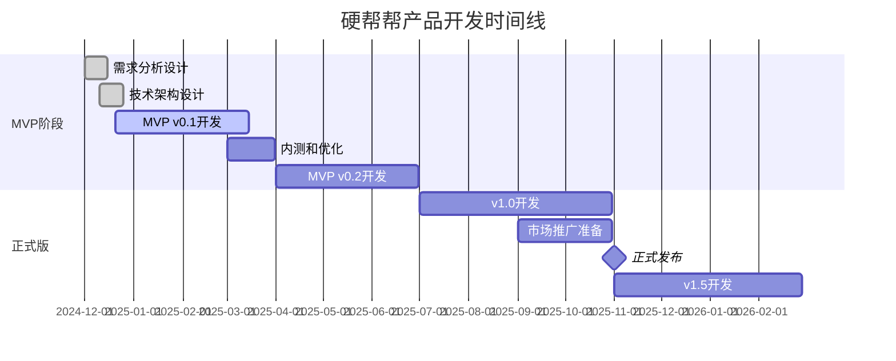

# 硬帮帮(Yinbangbang) 产品路线图 (Roadmap)

## 1. 路线图概述

### 1.1 战略目标
硬帮帮致力于成为年轻人身边最贴心的即时互助平台，通过分阶段产品迭代，逐步建立完善的超本地互助生态系统。

### 1.2 发展阶段
- **MVP阶段** (0-6个月): 验证核心假设，建立基础用户群
- **成长阶段** (6-18个月): 扩大用户规模，完善功能体系
- **成熟阶段** (18-36个月): 深化用户价值，探索商业模式
- **扩展阶段** (36个月+): 拓展服务边界，建立生态平台

### 1.3 核心原则
- **用户价值优先**: 每个版本都要为用户创造实际价值
- **快速迭代**: 小步快跑，快速验证和调整
- **数据驱动**: 基于用户反馈和数据分析决策
- **技术稳定**: 确保系统稳定性和安全性

## 2. 版本规划策略

### 2.1 版本命名规则
- **MVP**: v0.x (最小可行产品)
- **正式版本**: v1.x, v2.x (主要功能版本)
- **功能更新**: vx.y (次要功能更新)
- **Bug修复**: vx.y.z (问题修复版本)

### 2.2 发布周期
- **MVP**: 2-3个月一个大版本
- **正式版**: 3-4个月一个大版本
- **功能更新**: 2-4周一个小版本
- **紧急修复**: 随时发布

### 2.3 平台发布策略
- **iOS优先**: 先发布iOS版本进行用户验证
- **Android跟进**: iOS稳定后1-2周发布Android版本
- **同步更新**: 正式版本后保持双平台同步更新

## 3. 详细版本规划

### 3.1 MVP v0.1 - 核心功能验证 (第1-3个月)

#### 3.1.1 版本目标
- 验证超本地互助的核心假设
- 建立基础的供需匹配机制
- 获得初始用户反馈
- 测试技术架构可行性

#### 3.1.2 核心功能
**用户系统 (P0)**
- 手机号注册登录
- 基础个人资料设置
- 位置权限获取和定位
- 简单实名认证(身份证号)

**需求发布 (P0)**
- 4个基础分类(代取代买/拼单/借用/其他)
- 文字描述需求(限100字)
- 设置报酬金额(1-20元)
- 自动获取当前位置

**需求匹配 (P0)**
- 基于距离的需求推送(500米范围)
- 简单的需求列表展示
- 一键接单功能
- 基础的联系方式交换

**支付系统 (P0)**
- 微信支付集成
- 预付费+资金托管
- 简单的交易确认
- 基础退款机制

**信用系统 (P0)**
- 初始信用分100分
- 完成任务+5分，爽约-10分
- 信用分显示

#### 3.1.3 技术实现
- iOS原生开发(Swift)
- 后端API开发(Spring Boot)
- MySQL数据库
- 高德地图集成
- 微信支付SDK

#### 3.1.4 成功指标
- 注册用户数: 1000人
- 日活用户数: 100人
- 需求发布量: 50单/天
- 需求完成率: 60%
- 用户留存率: 次日30%

### 3.2 MVP v0.2 - 体验优化 (第4-6个月)

#### 3.2.1 版本目标
- 优化用户体验和界面设计
- 完善核心功能流程
- 提升系统稳定性
- 扩大测试用户群体

#### 3.2.2 新增功能
**用户体验优化 (P0)**
- 人脸识别实名认证
- 新用户引导流程
- 消息推送通知
- 用户反馈系统

**功能完善 (P1)**
- 需求编辑和取消
- 任务进度跟踪
- 双向评价系统
- 交易历史记录

**系统优化 (P0)**
- 性能优化和Bug修复
- 数据统计埋点
- 基础客服系统
- 安全防护加强

#### 3.2.3 Android版本开发
- Android原生开发启动
- 核心功能移植
- 双平台功能对齐

#### 3.2.4 成功指标
- 注册用户数: 5000人
- 日活用户数: 500人
- 需求发布量: 200单/天
- 需求完成率: 70%
- 用户留存率: 次日40%, 7日20%

### 3.3 v1.0 - 正式发布版 (第7-10个月)

#### 3.3.1 版本目标
- 正式对外发布产品
- 建立完整的产品功能体系
- 开始规模化用户获取
- 验证商业模式可行性

#### 3.3.2 核心功能升级
**智能匹配系统 (P0)**
- 基于多维度的智能推荐算法
- 用户偏好学习
- 匹配成功率优化
- 实时位置更新

**社交功能 (P1)**
- 邻里发现功能
- 用户互关注
- 简单的社区动态
- 用户标签系统

**运营工具 (P0)**
- 后台管理系统
- 数据分析面板
- 用户行为监控
- 内容审核工具

**商业化功能 (P1)**
- 平台手续费(5%)
- 会员特权系统
- 广告位预留
- 商家合作接口

#### 3.3.3 技术架构升级
- 微服务架构改造
- Redis缓存优化
- CDN静态资源加速
- 监控告警系统

#### 3.3.4 成功指标
- 注册用户数: 2万人
- 日活用户数: 3000人
- 需求发布量: 1000单/天
- 需求完成率: 75%
- 月交易额: 10万元

### 3.4 v1.5 - 功能扩展 (第11-14个月)

#### 3.4.1 版本目标
- 扩展服务场景和功能边界
- 提升用户粘性和活跃度
- 探索新的增长点
- 优化运营效率

#### 3.4.2 新增功能
**场景扩展 (P1)**
- 语音发布需求
- 图片需求描述
- 紧急需求标识
- 定时需求发布

**用户成长体系 (P1)**
- 用户等级系统
- 成就徽章
- 积分商城
- 邀请奖励机制

**AI智能助手 (P2)**
- 智能需求分类
- 自动价格建议
- 异常行为识别
- 客服机器人

#### 3.4.3 成功指标
- 注册用户数: 5万人
- 日活用户数: 8000人
- 需求发布量: 2000单/天
- 需求完成率: 80%
- 月交易额: 25万元

### 3.5 v2.0 - 生态建设 (第15-18个月)

#### 3.5.1 版本目标
- 建立完整的互助生态
- 深化用户价值创造
- 实现可持续的商业模式
- 为规模化扩张做准备

#### 3.5.2 核心功能
**生态平台 (P0)**
- 商家入驻系统
- 服务商认证
- 第三方服务集成
- 开放API平台

**高级功能 (P1)**
- AR导航功能
- 语音交互
- 视频通话
- 群组互助

**数据智能 (P1)**
- 用户画像分析
- 需求预测模型
- 个性化推荐
- 运营策略优化

#### 3.5.3 成功指标
- 注册用户数: 10万人
- 日活用户数: 2万人
- 需求发布量: 5000单/天
- 需求完成率: 85%
- 月交易额: 50万元

## 4. 功能优先级矩阵

### 4.1 优先级定义
- **P0 (必须有)**: 产品核心功能，缺失会影响基本使用
- **P1 (应该有)**: 重要功能，显著提升用户体验
- **P2 (可以有)**: 锦上添花功能，资源充足时开发
- **P3 (暂不做)**: 未来考虑功能，当前版本不开发

### 4.2 功能优先级矩阵

| 功能模块 | MVP v0.1 | MVP v0.2 | v1.0 | v1.5 | v2.0 |
|----------|----------|----------|------|------|------|
| 用户注册登录 | P0 | P0 | P0 | P0 | P0 |
| 实名认证 | P0 | P0 | P0 | P0 | P0 |
| 需求发布 | P0 | P0 | P0 | P0 | P0 |
| 智能匹配 | P0 | P0 | P0 | P0 | P0 |
| 支付系统 | P0 | P0 | P0 | P0 | P0 |
| 信用系统 | P0 | P1 | P0 | P0 | P0 |
| 评价系统 | P2 | P1 | P0 | P0 | P0 |
| 消息通知 | P2 | P0 | P0 | P0 | P0 |
| 社交功能 | P3 | P2 | P1 | P1 | P0 |
| 语音功能 | P3 | P3 | P2 | P1 | P1 |
| AR导航 | P3 | P3 | P3 | P2 | P1 |
| 商家入驻 | P3 | P3 | P3 | P2 | P0 |
| AI助手 | P3 | P3 | P3 | P2 | P1 |

## 5. 详细时间线计划

### 5.1 第一年时间线 (2024年12月 - 2025年12月)

### 5.2 关键里程碑

| 里程碑 | 时间 | 目标 | 成功标准 |
|--------|------|------|----------|
| MVP v0.1发布 | 2025年3月 | 核心功能验证 | 1000注册用户，60%完成率 |
| 获得种子用户 | 2025年4月 | 建立用户基础 | 5000注册用户，活跃社群 |
| MVP v0.2发布 | 2025年6月 | 体验优化完成 | 5000注册用户，70%完成率 |
| Android版发布 | 2025年7月 | 双平台覆盖 | 双平台用户1:1比例 |
| v1.0正式发布 | 2025年11月 | 产品正式上线 | 2万注册用户，月交易额10万 |
| 盈亏平衡 | 2026年6月 | 商业模式验证 | 月收入覆盖运营成本 |

### 5.3 风险时间缓冲
- 每个开发阶段预留20%的时间缓冲
- 关键功能开发预留备选方案
- 外部依赖(支付、地图等)预留集成时间
- 应用商店审核预留1-2周时间

## 6. 资源规划

### 6.1 团队配置建议

**MVP阶段 (6人团队)**
- 产品经理: 1人
- iOS开发: 1人
- Android开发: 1人
- 后端开发: 2人
- UI/UX设计: 1人

**正式版阶段 (10人团队)**
- 产品经理: 1人
- 前端开发: 3人 (iOS 1人, Android 1人, Web 1人)
- 后端开发: 3人
- UI/UX设计: 1人
- 测试工程师: 1人
- 运营专员: 1人

**成长阶段 (15人团队)**
- 在正式版基础上增加:
- 数据分析师: 1人
- 客服专员: 2人
- 市场推广: 2人

### 6.2 技术资源需求

**基础设施**
- 云服务器: 阿里云/腾讯云
- 数据库: MySQL + Redis
- 存储: OSS对象存储
- CDN: 静态资源加速
- 监控: 应用性能监控

**第三方服务**
- 地图服务: 高德地图API
- 支付服务: 微信支付 + 支付宝
- 短信服务: 阿里云短信
- 推送服务: 极光推送
- 实名认证: 阿里云实人认证

### 6.3 预算规划

**MVP阶段 (6个月)**
- 人力成本: 60万元
- 技术服务: 5万元
- 运营推广: 10万元
- 总计: 75万元

**第一年总预算**
- 人力成本: 150万元
- 技术服务: 15万元
- 运营推广: 50万元
- 其他费用: 10万元
- 总计: 225万元

## 7. 风险管理

### 7.1 技术风险

**风险识别**
- 位置定位精度不足
- 支付系统集成复杂
- 高并发性能问题
- 数据安全和隐私保护

**应对策略**
- 多个地图服务商备选方案
- 分阶段支付功能开发
- 性能测试和优化
- 安全审计和合规检查

### 7.2 市场风险

**风险识别**
- 用户接受度不高
- 竞争对手快速跟进
- 监管政策变化
- 商业模式不可持续

**应对策略**
- 深度用户调研和快速迭代
- 建立技术和运营壁垒
- 密切关注政策动向
- 多元化收入模式探索

### 7.3 运营风险

**风险识别**
- 恶意用户和虚假需求
- 用户纠纷和投诉
- 资金安全问题
- 团队人员流失

**应对策略**
- 完善的信用和审核机制
- 专业客服和纠纷处理流程
- 资金托管和保险机制
- 股权激励和团队建设

### 7.4 风险监控指标

| 风险类型 | 监控指标 | 预警阈值 | 应对措施 |
|----------|----------|----------|----------|
| 技术风险 | 系统可用性 | <99% | 紧急修复 |
| 市场风险 | 用户增长率 | <10%/月 | 策略调整 |
| 运营风险 | 投诉率 | >5% | 流程优化 |
| 资金风险 | 现金流 | <3个月 | 融资计划 |

## 8. 成功评估标准

### 8.1 阶段性目标

**MVP阶段成功标准**
- 产品功能完整可用
- 获得1000+种子用户
- 需求完成率>60%
- 用户反馈积极

**正式版成功标准**
- 月活用户>1万
- 月交易额>10万元
- 用户满意度>4.0
- 实现盈亏平衡

**成长期成功标准**
- 月活用户>5万
- 月交易额>50万元
- 市场占有率>10%
- 建立品牌影响力

### 8.2 调整机制

**数据驱动决策**
- 每周数据回顾会议
- 每月产品策略评估
- 每季度路线图调整

**用户反馈循环**
- 用户访谈和调研
- 应用商店评价分析
- 客服反馈汇总
- 社交媒体监听

**竞争环境监控**
- 竞品功能对比分析
- 市场动态跟踪
- 行业趋势研究

---

**文档状态**: 初稿完成  
**最后更新**: 2024-12-19  
**下次评审**: 2024-12-26  
**关联文档**: PRD.md, User_Story_Map.md, Metrics_Framework.md